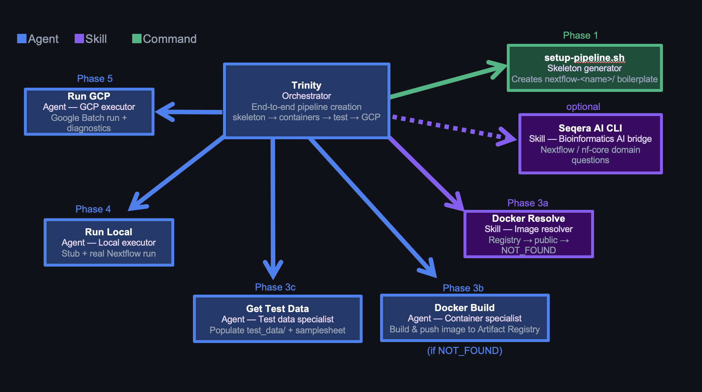

> Presented at Nextflow Summit 2026. Technical architecture behind the talk — for bioinformaticians who know Nextflow but are new to agentic tooling.

---

## The Problem

One person. Every role: sysadmin, developer, data engineer, analyst, collaborator.

Multiple datasets. Hundreds of samples each. Researchers arrive with new hypotheses needing a published tool wrapped into a runnable pipeline — not in two months, now. Development time becomes the bottleneck, not the science.

AI agents can close that gap — but only if you invest in context first. Speed comes not from model intelligence but from encoding what to do before the agent starts.

Available @ https://github.com/ghobriallab/pipelines

## Architecture Overview

Three tiers:

- **Agents** — autonomous workers that execute tasks, spawn sub-agents, and handle failures
- **Skills** — cross-cutting resolvers invoked inline (no side effects, no sub-agent spawn)
- **Commands** — shell scripts for deterministic scaffolding

One sentence triggers the whole chain: `Trinity, I need a nextflow pipeline using https://github.com/RabadanLab/arcasHLA.`

[Nextflow](https://nextflow.io) is a workflow orchestration framework for scalable and reproducible scientific pipelines.

---

## Trinity: The Orchestrator

Trinity is the only entry point for pipeline creation. It runs six phases in order, with explicit parallelism and sequential gates built in.



### Phase Flow

```
Phase 0: Parse pipeline name and tools from user message
Phase 1: Create skeleton (setup-pipeline.sh) or verify existing one
Phase 2: Confirm pipeline intent (input type, tool list)
Phase 3a: Resolve container image (docker-resolve skill)
Phase 3b: Build custom container [conditional, only if NOT_FOUND]
Phase 3c: Prepare test data [always, parallel with 3b if applicable]
Phase 4: Local run — stub then real [sequential, must pass before Phase 5]
Phase 5: GCP run — Google Batch [sequential]
Phase 6: Final report
```

Phases 3b and 3c run **in parallel** when a Docker build is needed — container build and test data prep are independent. Phases 4 and 5 are **sequential** — a failing local run blocks GCP.

### Optional: Seqera AI for Nextflow-specific problems

Trinity has the [Seqera AI](https://seqera.io/ask-ai/) CLI as a fallback for DSL2 edge cases, nf-core module patterns, or Batch executor behavior it can't resolve from context alone:

```bash
seqera ai --headless "How do I emit two outputs from the same process with different types in DSL2?"
```

Runs headless, returns to Trinity without breaking the conversation chain. Used sparingly — credits are limited.

When to use vs. WebSearch:
- **WebSearch**: public docs, GitHub issues, Stack Overflow — free, fast
- **[Seqera AI](https://seqera.io/ask-ai/)**: Nextflow-specific reasoning, nf-core module internals, Batch executor nuance — use when WebSearch returns conflicting or outdated results

### Critical: docker-resolve is a skill, not a tool call

`docker-resolve` is listed in Trinity's frontmatter as a preloaded skill:

```yaml
---
name: trinity
skills:
  - docker-resolve
---
```

Trinity executes docker-resolve logic directly via Bash — not via the `Skill` tool. Invoking the `Skill` tool mid-conversation emits a response to the parent agent and **terminates Trinity prematurely** — Phases 3c, 4, and 5 never run.

The parent assistant has a matching hard rule: **never pre-run docker-resolve before spawning Trinity**. Pre-supplying the image causes Trinity to skip Phases 3c–5 entirely.

---

## docker-resolve: The Container Skill

Pure lookup, no side effects. Three checks in order, stops at first success.

### Check 1: Artifact Registry (custom images)

```bash
gcloud artifacts repositories list \
  --project=$GCP_PROJECT \
  --format="value(name)"
```

Fuzzy-match against the tool name. For each matching repo, list images and verify reachability with `docker manifest inspect`. Prefer pinned version over `latest`.

### Check 2: Existing container directives

For each `container` directive in pipeline modules and `nextflow.config`, verify the URL is live. Wave URLs via `curl --head`, others via `docker manifest inspect`.

### Check 3: Public registries

[Seqera Wave](https://seqera.io/wave/) → [biocontainers](https://biocontainers.pro/) → [nf-core](https://nf-co.re/) quay.io. Always verify before returning.

### Output

```
STRATEGY: USE_EXISTING_CUSTOM | USE_EXISTING_PUBLIC | POPULATE_PUBLIC | NOT_FOUND
IMAGE_URL: <full image URL, or "none" if NOT_FOUND>
NOTES: <what was checked>
```

`NOT_FOUND` triggers docker-build. Otherwise Trinity records the URL and continues.

---

## docker-build: The Container Agent

Only spawned when docker-resolve returns `NOT_FOUND`. Reads the tool's README, writes a Dockerfile, builds, and pushes.

**Always: `--platform linux/amd64`.** GCP Batch VMs are x86_64. Apple Silicon Macs must still target x86_64 or the container won't run on Batch.

**One repo per tool, not per pipeline.** Artifact Registry repos are named after the tool (`arcashla`, `cellranger`), not the pipeline. Containers reuse across pipelines.

**Baked-in reference databases.** Some tools (arcasHLA) need reference data downloaded at build time:
1. Install `git-lfs` if the reference uses `git clone` — without it, large repos silently download pointer files only
2. Pin the reference version (`--version X.Y.Z`) — `--latest` breaks reproducibility

---

## get-test-data: The Test Data Agent

Runs in parallel with docker-build. Populates `test_data/` with minimal, realistic inputs.

### Attempt Order

1. **nf-core module fixtures** — curated table of known test files per tool
2. **Tool's own GitHub repository** — look for test/ or data/ directories (max 3 API calls)
3. **nf-core test-datasets catalog** — grep by input type (FASTQ paired/single, BAM, VCF)
4. **Synthetic data** — Python FASTQ generator or `seqtk subsample` (asks user first)

### Output contract

- `test_data/samplesheet_test.csv` with exact column names expected by `main.nf`
- 2 samples (`sample1`, `sample2`) — enough to exercise branching
- Relative paths inside `test_data/`
- All referenced files exist and are non-empty

---

## run-local: The Local Executor

Stub first, then real. Never proceeds to GCP until local passes.

```bash
# 1. Stub run — validates DSL2 syntax and channel wiring without running tools
nextflow run main.nf -profile test -stub

# 2. Real run
nextflow run main.nf -profile test
```

On failure, the agent attempts one fix per error type (max 3 attempts total):

| Error pattern | Fix |
|--------------|-----|
| `samplesheet not found` | Correct path in `nextflow.config` test profile |
| `Unknown parameter` | Add param to `nextflow.config` params block |
| `No such variable` | Fix module path or channel reference in `main.nf` |
| Stub syntax error | Fix `stub:` block in process module |

**Success gate:** `Status : SUCCESS` in Nextflow log + `results_test/` non-empty.

---

## run-gcp: The Cloud Executor

Pre-flight checks before any Nextflow command. All must pass:

1. `gcloud auth list` — active account
2. `gcloud services list` — Batch API enabled
3. `gsutil ls $GCP_WORK_DIR` — work bucket accessible
4. `docker manifest inspect <image>` — container reachable from GCP
5. Grep pipeline configs for placeholder strings like `YOUR_PROJECT` or `CHANGEME`
6. Executor is `google-batch` (not deprecated `google-lifesciences`)
7. If input files >150 GB: set `stageInMode = 'copy'` and disk to 500 GB

Exit codes 125, 14, and 50001 → retry, not failure. Batch uses spot VMs by default; preemptions are expected.

---

## Environment Variables: The Adaptability Layer

Every agent reads `.env` at startup. Same agent definitions work across different GCP projects, registries, and filesystem layouts — no agent code changes needed.

```bash
# .env
GCP_PROJECT="team-pipelines"
GCP_REGION="us-east1"
GCP_WORK_DIR="gs://team-pipelines/scratch"
ARTIFACT_REGISTRY="us-docker.pkg.dev/team-pipelines"
PIPELINES_DIR="."
DOCKER_DEFAULT_PLATFORM="linux/amd64"
```

To port to a different lab or cloud account, change `.env` — nothing else.

**One hostname rule:** `$ARTIFACT_REGISTRY` already contains the full registry prefix. Never derive a regional variant:

```
us-docker.pkg.dev/team-pipelines      ← correct, verbatim from $ARTIFACT_REGISTRY
us-east1-docker.pkg.dev/team-pipelines ← wrong, never derive from $GCP_REGION
```

Without this rule, the model derives a plausible-looking but wrong hostname. It's repeated verbatim in `.memory/containers.md`, docker-resolve, and docker-build.

---

## The Memory System

`.memory/` is a concept-based knowledge base loaded at agent startup — not embedded into prompts.

```
.memory/
  overview.md      — existing pipelines, quick start
  structure.md     — DSL2 layout, naming conventions
  templates.md     — process templates, samplesheet patterns
  commands.md      — how to invoke Trinity, setup-pipeline, add-process
  workflow.md      — step-by-step dev flow
  testing.md       — nf-test patterns, test data sources, checklists
  development.md   — VS Code + Nextflow LSP setup
  patterns.md      — input handling, branching, output management
  gcp.md           — GCP config, error codes, resource patterns
  containers.md    — container priority, Dockerfile patterns, known images
```

Agents read only the files relevant to their phase — `run-gcp` reads `gcp.md`, `docker-build` reads `containers.md`. Loading everything into every agent wastes tokens and dilutes focus.

The files encode **lab-specific conventions** no generic model knows:
- Use `pixi run nextflow` not bare `nextflow`
- `$ARTIFACT_REGISTRY` already includes the project — never append `$GCP_PROJECT`
- GCP Batch spot codes: 125, 14, 50001 → retry
- DSL2: process names UPPERCASE, directory names lowercase_underscore

---

## Permissions: Bounding the Blast Radius

Agents run Bash autonomously. Without explicit limits, the blast radius is unbounded.

`.claude/settings.local.json` uses an allowlist-deny model:

```json
{
  "permissions": {
    "allow": [
      "Bash(docker *)",
      "Bash(gcloud artifacts *)",
      "Bash(pixi run *)",
      "Bash(nextflow *)",
      "Bash(git *)"
    ],
    "deny": [
      "Bash(rm -rf *)",
      "Bash(rm -r *)",
      "Bash(rm *)"
    ]
  }
}
```

`rm` in any form requires user confirmation. Everything outside the allow list also prompts — but the deny list catches destructive cases even if a wildcard allow is added later.

---

## Three Hard Rules

**Rule 1: Never pre-run docker-resolve before spawning Trinity.**

It's tempting to resolve the container first and pass the URL in. Don't. Trinity skips Phases 3c, 4, and 5 when the image is pre-supplied — no test data, no local run, no GCP run.

**Rule 2: Spawn Trinity exactly once per request.**

One `Agent(subagent_type: "trinity", ...)` covers all six phases. Each spawn starts fresh — splitting across multiple spawns breaks state.

**Rule 3: Context is the product.**

Speed comes from what the model knows before it starts: `.memory/` files encoding lab conventions, `.env` resolving GCP paths, agent instructions listing failure modes and fixes. Writing those files is the engineering work. An agent without context makes the same mistakes as a model with none.

---

## Tips for Replication

**Start minimal.** Trinity + docker-resolve + run-local is enough to validate the pattern. Add run-gcp only after local is reliable.

**Write `.memory/` before writing agents.** An agent that knows your container registry hostname, package manager, and GCP project structure makes far fewer wrong turns.

**Set deny rules before enabling autonomous runs.** Add `Bash(rm *)` to the deny list on day one. Agents cleaning up failed builds will delete things you didn't intend.

**One container repo per tool.** First pipeline builds and pushes. Every subsequent pipeline finds it via docker-resolve Check 1. Reuse compounds.

**Preload skills as frontmatter, not inline invocations.** If an agent must not emit a standalone response mid-conversation, load the skill via frontmatter and execute its logic directly with Bash — not via the `Skill` tool.

---

## Repository

Full agent configuration lives in the Ghobrial Lab pipelines repository. `.claude/` contains agent definitions, skills, and settings. `.memory/` contains the knowledge base. The model is the executor — the context is the system.
