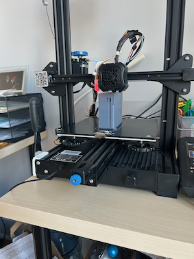
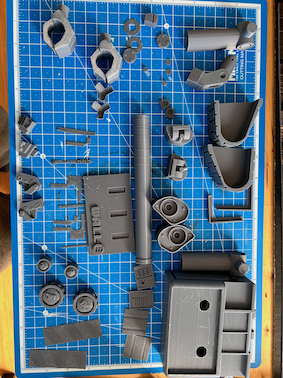
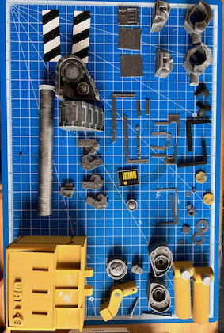
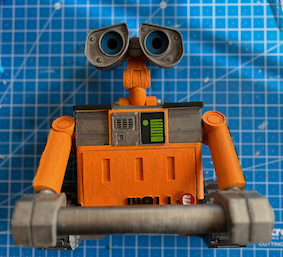
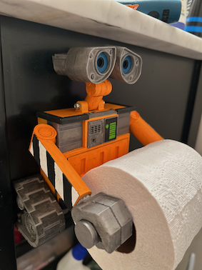

It was that time that after 6 months of having the TP holder broken, we decided to make a cute update. It took a couple of months to finish it. Thanks to [Thingverse](https://www.thingiverse.com) for the [model](https://www.thingiverse.com/thing:3709814) with some tweaks.

