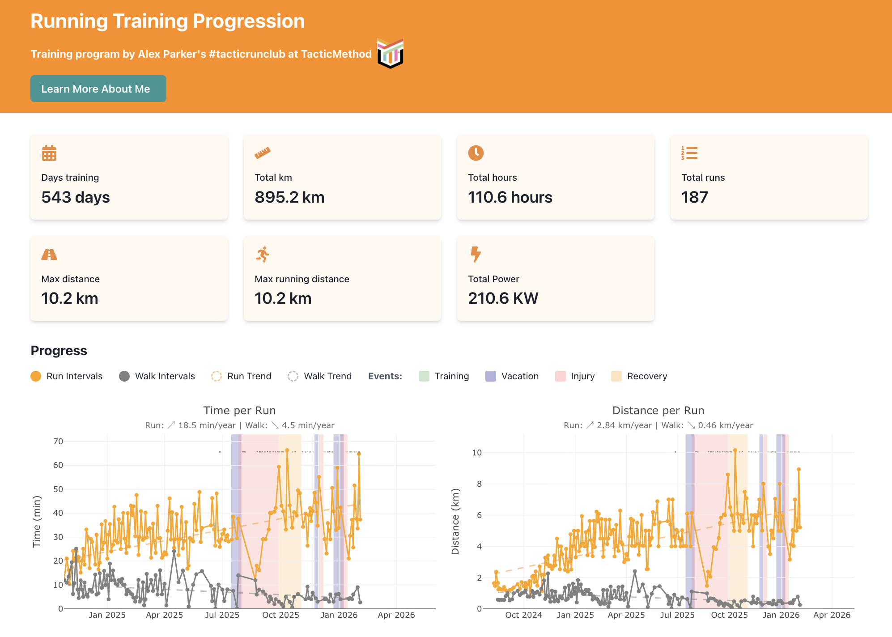

Your watch buzzes. "Congratulations on your fastest 5K this month!"

But you don't feel faster. And last month, you had three "fastest" runs that contradicted each other.

I kept getting these notifications. Weekly summaries told me I was improving. Or declining. Or both, depending on which metric the app decided mattered that week.

The numbers existed. But they meant nothing without context.

So I built my own dashboard to see what was actually happening.

Take a [look](https://run-training-activities.netlify.app/) ➡️.

## The Problem With Fitness Apps

Fitness apps celebrate individual achievements. A personal record. A streak maintained. A badge earned.

They show weekly summaries that create false urgency. Up 10% from last week feels like progress. Down 5% feels like failure.

But fitness doesn't work on weekly cycles. Your body adapts over months, not days, or even years.

Individual run metrics mean nothing without seeing the bigger picture over time. Context matters more than numbers.

## What I Wanted

I started following a structured training program ([Tactic Method](https://tacticmethod.com) with coach Alex Parker). Run-walk intervals. Progressive distance. Specific pace targets.

I wanted to answer one question: Is this structured approach actually working?

Not based on how I felt after one run. Not based on weekly summaries that changed with the weather.

Based on months of data showing whether the effort was producing results.

And I wanted to own my data. Not pay for premium features to see insights about my own body—insights I can't even fully control.

## What I Built

I created a dashboard that:
- Downloads my Garmin FIT files automatically
- Tracks time, distance, pace, and heart rate across all runs
- Visualizes trends over months with run/walk intervals separated
- Shows training events and phases marked on the timeline

The technical stack: Python for data extraction, React with Plotly for visualization. I'm a scientist who codes for data analysis, so I adapted familiar tools to a new domain.

Not a polished product. A working tool to see patterns.

## What I Learned

### 1. Numbers Without Context Are Noise

That "slow" run last Tuesday? Probably faster than any run you did six months ago.

Your watch tells you about one data point. The dashboard shows whether that point is part of an upward trend, a plateau, or normal variation.

Single metrics mean nothing. Patterns over time mean everything.

### 2. Week-to-Week Progress Is a Myth

My data revealed:
- Big improvements at first
- Some plateauing for a while
- A hard time after an injury
- Overall, still improving

Apps want you to believe weekly progress is linear. The data shows it's messy, inconsistent, and happens in waves.

[Research shows](https://pmc.ncbi.nlm.nih.gov/articles/PMC6492765/) that structured training produces measurable improvements at 12-week intervals. Not weekly. Not even monthly in most cases.

Week-to-week numbers are all over the place. That's normal. That's adaptation.

### 3. Structured Training Shows Up in Data

When I started following the Tactic Method program, I could see the changes:
- Distance trend line slope increased
- Run and walk interval paces became more consistent

Not after one week. After months.

It is said that structured, periodized training programs are more effective than unstructured running.

My data matched this.

### 4. Seeing Accumulation Keeps You Going

This was the unexpected benefit.

The most powerful insight wasn't about trends or training effectiveness. It was seeing the pile of work already done.

When energy is low and motivation fades, the dashboard doesn't show a streak to maintain or a goal to chase. It shows months of accumulated effort. I'm at 210.6 kWh—I could power approximately 80–100 homes (maybe not at -20 °C; if you know what I'm talking about, I'm sorry; if not, you're lucky).

Evidence: you've already done this much. You can keep going.

Apps celebrate streaks because they want daily engagement. This celebrates accumulation because it shows long-term commitment.

The difference matters when you need a push to get out the door.

### 5. You Can Trust the Long Game

Apps want you to check daily.

Real fitness happens slowly.

The monthly view shows what daily anxiety misses: whether your training is actually working.

## How You Can Do This

Not a full tutorial, but guidance:

**Want help?** If you have Garmin data and want something similar, reach out. I'm offering to help set this up for others who want to see their training in context.

Yes, there's technical setup. But between AI tools and my offer to help, you have support to figure it out.

### Get Your Data
Garmin lets you download FIT files from your activities. These contain all the metrics your watch records during runs.

### Choose Your Tools
I used Python and React because I'm comfortable with data analysis. But tools don't matter as much as seeing patterns.

If you're not comfortable with code, AI tools like Claude or GitHub Copilot can bridge the gap. They can explain code, suggest modifications, and help you troubleshoot errors.

The goal is visualization, not perfection.

### Start Simple
Pick one metric that matters to you. Distance. Pace. Heart rate. Track it over time.

Don't try to build everything at once.

### Be Patient
You need months of data to see meaningful trends. Three months minimum. Six months better.

This isn't an instant gratification project.

### Use My Code as a Starting Point
I've shared the project on [GitHub](https://github.com/lpantano/run-training-dashboard). It's not a finished product. It's a foundation you can customize.

### AI Tools Can Help
Don't let the code intimidate you. Tools like Claude or GitHub Copilot can help you understand and modify the code.

Ask them: "Explain what this function does." Or: "How do I change this to track weekly averages instead of daily runs?"

These AI assistants make working with code more accessible. You don't need to be a programmer to adapt this dashboard to your needs.

## The Real Insight

Fitness apps are designed to keep you engaged daily. Your body improves monthly.

The best training insight isn't from one run. It's from seeing six months of context that reveals whether your effort is actually working.

And when motivation dips, it's not another badge you need. It's seeing the work you've already accumulated.

That's what keeps you going.

---

## Try It Yourself

Start by exporting your own data and looking at it. Not through an app's filtered view. Just the raw patterns over time.

What might you discover in your own training?

**Project Repository**: [run-training-dashboard](https://github.com/lpantano/run-training-dashboard)

**Want help setting this up?** Contact me through [Instagram](https://www.instagram.com/lorena.pantano/) or my [LinkedIn](https://www.linkedin.com/in/lpantano/).
