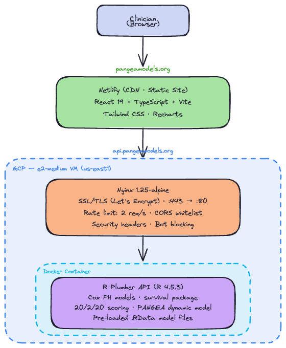

I work at the [Ghobrial Lab at Dana-Farber Cancer Institute](https://ghobriallab.dana-farber.org/), where I'm building their bioinformatics platform. Part of that work is making research tools accessible — which is how I got the opportunity to build the web app for their latest publication.

A new Nature Medicine paper ([10.1038/s41591-026-04304-x](https://doi.org/10.1038/s41591-026-04304-x)) introduces PANGEA-SMM — a dynamic risk calculator for smoldering multiple myeloma (SMM) that tracks longitudinal biomarkers to predict progression without requiring a bone marrow biopsy.

The model is free and live at [pangeamodels.org](https://pangeamodels.org).

> **Note**: PANGEA-SMM is a research tool intended to support clinical decision-making. It is not FDA-approved and should not replace physician judgment or established clinical guidelines.

Here's how we built the infrastructure behind it, and why we moved away from R Shiny.

## The Starting Point: R Shiny

The first version was an [R Shiny](https://shiny.posit.co/) app. It worked for demos and internal use — but Shiny has real limits when you need something available 24/7 to clinicians worldwide:

- Shiny server concurrency is limited without significant infrastructure
- Session state makes horizontal scaling harder
- Cold starts on free-tier hosting are slow and unreliable
- Bundle deployment and versioning are clunky

We needed something that felt fast, was easy to maintain, and could serve real clinical users reliably.

## The Architecture

The redesign splits the app into two services with clear responsibilities:

**Frontend: React + TypeScript on Netlify**

The UI is a [React 19](https://react.dev/) SPA built with [Vite](https://vite.dev/) and [Tailwind CSS](https://tailwindcss.com/). [Netlify](https://www.netlify.com/) handles CI/CD automatically — every push to main deploys. The static site is served via CDN globally, so load times are fast regardless of where the clinician is.

[Recharts](https://recharts.org/) powers the 5-year progression curves with confidence intervals. Validation happens client-side (TypeScript hooks) before any API call is made.

**Backend: R Plumber on GCP**

The statistical heavy lifting stays in R — where the Cox proportional hazards models live. [R Plumber](https://www.rplumber.io/) exposes two REST endpoints:

- `POST /calculate-score/static` — standard risk calculation
- `POST /calculate-score/dynamic` — incorporates patient history for trajectory-aware prediction

The R service runs in [Docker](https://www.docker.com/) on a [GCP](https://cloud.google.com/) e2-medium VM (2 vCPU, 4 GB RAM). [Nginx](https://nginx.org/) sits in front, handling SSL termination, rate limiting (2 req/s for API endpoints), CORS, and security headers.

[Let's Encrypt](https://letsencrypt.org/) manages the certificate automatically.

## Infrastructure Diagram

## Why This Split Works

Keeping R in the backend was the right call. The models are trained and validated in R — reimplementing them in Python or JavaScript would introduce risk and require revalidation. [R Plumber](https://www.rplumber.io/) makes it straightforward to wrap R functions as REST endpoints.

Moving the UI to React decouples the presentation from the computation. The frontend team doesn't need to touch R, and the R code doesn't need to worry about rendering.

The stateless API design also means there's no database. Patient data is passed in the request body and never stored — important both for privacy and for keeping the system simple.

## What We'd Do Differently

A few things to note if you're building something similar:

- **Cold start**: R Plumber takes ~10 seconds to start, so the Nginx timeout is set to 30 seconds. This is fine for a VM that's always running, but would be a problem on a serverless setup.
- **Rate limiting**: 2 requests/second is intentionally conservative. Cox model prediction is fast (~100ms), but we wanted to protect against accidental hammering.
- **No auth**: This is a public health tool — no login required. That's a deliberate choice, not an oversight.

## Video Demo

Below is a short clip comparing the original R Shiny prototype to the current production app.



The model, the logic, the clinical interpretation — all the same. What changed is reliability, speed, and the ability to reach clinicians anywhere.

---

**Paper**: [Enhanced dynamic risk stratification of smoldering multiple myeloma](https://doi.org/10.1038/s41591-026-04304-x) — Nature Medicine, March 2026

**Calculator**: [pangeamodels.org](https://pangeamodels.org)
